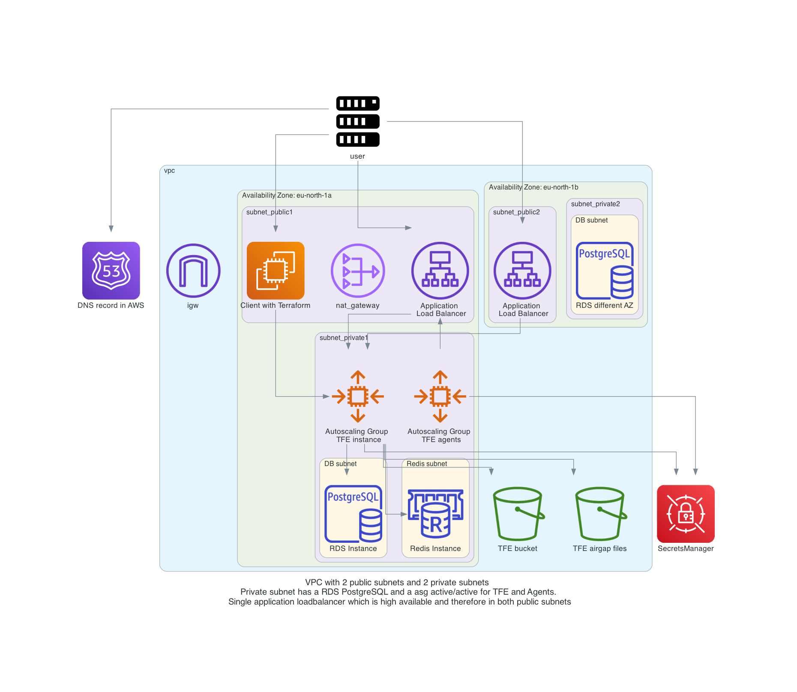
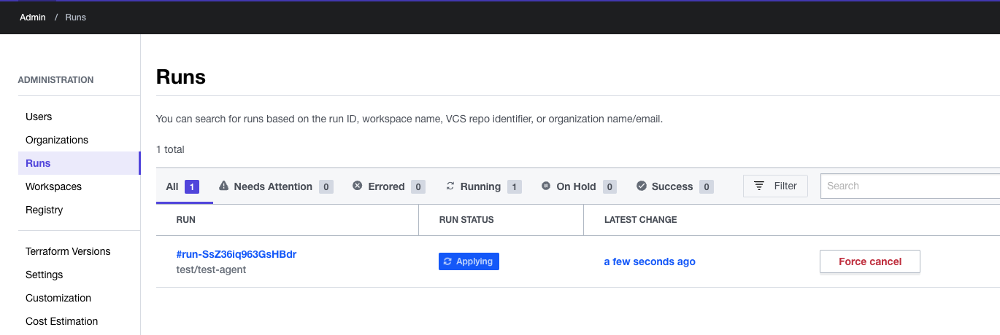
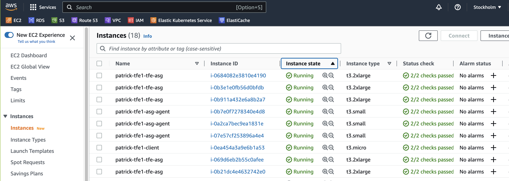
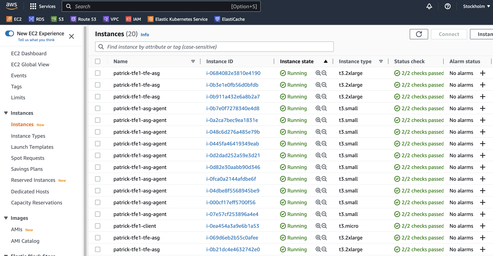

# TFE AWS installation Active/Active with agents
Install Prod External Services ( Redis + S3 + DB ) active-active installation AWS with the ability to use TFE agents

This repo is a combination of the following 2 repositories
- https://github.com/munnep/tfe_aws_active_mode
- https://github.com/munnep/tfe_aws_agents


With this repository you will be able to do a TFE (Terraform Enterprise) active/active airgap installation on AWS with external services for storage in the form of S3 and PostgreSQL. The server configuration is done by using an autoscaling launch configuration. The TFE instance will be behind a load balancer. Additionally you can add TFE agents with an autoscaling group. 

The Terraform code will do the following steps

- Create S3 buckets used for TFE
- Upload the necessary software/files for the TFE airgap installation to an S3 bucket
- Generate TLS certificates with Let's Encrypt to be used by TFE
- Create a VPC network with subnets, security groups, internet gateway
- Create a RDS PostgreSQL to be used by TFE
- Create an autoscaling launch configuration which defines the TFE instance and airgap installation
- An auto scaling group that points to the launch configuration
- Create an application load balancer for communication to TFE
- Create a Redis database
- Create an autoscaling launch configuration which defines the TFE instance and airgap installation active/active
- add a number of x TFE server nodes
- Create an autoscaling launch configuration which defines the TFE Agents

# Diagram

  

# Prerequisites

## License
Make sure you have a TFE license available for use

Store this under the directory `files/license.rli`

## Airgap software
Download the `.airgap` file using the information given to you in your setup email and place that file under the directory `./files`

Store this for example under the directory `files/652.airgap`

## Installer Bootstrap
[Download the installer bootstrapper](https://install.terraform.io/files/latest.tar.gz)

Store this under the directory `files/replicated.tar.gz`

## AWS
We will be using AWS. Make sure you have the following
- AWS account  
- Install AWS cli [See documentation](https://docs.aws.amazon.com/cli/latest/userguide/install-cliv2.html)

## Install terraform  
See the following documentation [How to install Terraform](https://learn.hashicorp.com/tutorials/terraform/install-cli)

## TLS certificate
You need to have valid TLS certificates that can be used with the DNS name you will be using to contact the TFE instance.  
  
The repo assumes you have no certificates and want to create them using Let's Encrypt and that your DNS domain is managed under AWS. 

# How to

## Build TFE active/active environment
- Clone the repository to your local machine
```sh
git clone https://github.com/munnep/tfe_aws_active-active_agents.git
```
- Go to the directory
```sh
cd tfe_aws_active-active_agents
```
- Set your AWS credentials
```sh
export AWS_ACCESS_KEY_ID=
export AWS_SECRET_ACCESS_KEY=
export AWS_SESSION_TOKEN=
```
- Store the files needed for the TFE Airgap installation under the `./files` directory, See the notes [here](./files/README.md)
- create a file called `variables.auto.tfvars` with the following contents and your own values
```hcl
tag_prefix                       = "patrick-tfe2"                             # TAG prefix for names to easily find your AWS resources
region                           = "eu-north-1"                               # Region to create the environment
vpc_cidr                         = "10.234.0.0/16"                            # subnet mask that can be used 
ami                              = "ami-09f0506c9ef0fb473"                    # AMI of the Ubuntu image  
rds_password                     = "Password#1"                               # password used for the RDS environment
filename_airgap                  = "652.airgap"                               # filename of your airgap software stored under ./airgap
filename_license                 = "license.rli"                              # filename of your TFE license stored under ./airgap
filename_bootstrap               = "replicated.tar.gz"                        # filename of the bootstrap installer stored under ./airgap
dns_hostname                     = "patrick-tfe2"                             # DNS hostname for the TFE
dns_zonename                     = "bg.hashicorp-success.com"                 # DNS zone name to be used
tfe_password                     = "Password#1"                               # TFE password for the dashboard and encryption of the data
certificate_email                = "patrick.munne@hashicorp.com"              # Your email address used by TLS certificate registration
terraform_client_version         = "1.1.7"                                    # Terraform version you want to have installed on the client machine
public_key                       = "ssh-rsa AAAAB3Nza"                        # The public key for you to connect to the server over SSH
asg_tfe_server_min_size          = 1                                          # TFE instance autoscaling group minimal size. 
asg_tfe_server_max_size          = 2                                          # TFE instance autoscaling group maximum size. 
asg_tfe_server_desired_capacity  = 2                                          # TFE instance autoscaling group desired size. 
create_agents                    = "false"                                    # After TFE creation and working you can set it to true
asg_tfe_agent_min_size           = 1                                          # TFE agent autoscaling group minimal size. 
asg_tfe_agent_max_size           = 2                                          # TFE agent autoscaling group maximum size. 
asg_tfe_agent_desired_capacity   = 1                                          # TFE agent autoscaling group desired size. 
```
- Terraform initialize
```sh
terraform init
```
- Terraform plan
```sh
terraform plan
```
- Terraform apply
```sh
terraform apply
```
- Terraform output should create 55 resources and show you the public dns string you can use to connect to the TFE instance
```sh
Apply complete! Resources: 55 added, 0 changed, 0 destroyed.

Outputs:

ssh_tf_client = "ssh ubuntu@patrick-tfe2-client.bg.hashicorp-success.com"
ssh_tfe_agent = "ssh -J ubuntu@patrick-tfe2-client.bg.hashicorp-success.com ubuntu@<internal ip address of a TFE agent>"
ssh_tfe_server = "ssh -J ubuntu@patrick-tfe2-client.bg.hashicorp-success.com ubuntu@<internal ip address of a TFE server>"
tfe_appplication = "https://patrick-tfe2.bg.hashicorp-success.com"
```
## enable agents
- Switch the value to `true` in the file variables.auto.tfvars
```
create_agents                   = true
asg_tfe_agent_min_size          = 1
asg_tfe_agent_max_size          = 10
asg_tfe_agent_desired_capacity  = 10
```
- run terraform apply. This will create an autoscaling group with TFE agents.
```sh
terraform apply
```
output
```sh
Apply complete! Resources: 2 added, 0 changed, 0 destroyed.
```
- Login to your TFE environment
https://patrick-tfe2.bg.hashicorp-success.com
- See the agents that are now available for your usage. Go to settings -> Agents    
    

- You are now able to use workspaces with these agents. Testing example [here](#testing)
- Remove everything by using terraform destroy
```sh
terraform destroy
```

- You now have a TFE active/active cluster with agents

## testing

- Go to the directory test_code
```sh
cd test_code
```
- login to your terraform environment just created
```sh
terraform login patrick-tfe2.bg.hashicorp-success.com
```
- Edit the `main.tf` file with the hostname of your TFE environment
```hcl
terraform {
  cloud {
    hostname = "patrick-tfe2.bg.hashicorp-success.com"
    organization = "test"

    workspaces {
      name = "test-agent"
    }
  }
}
```
- Run terraform init
```sh
terraform init
```
- run terraform apply
```sh
terraform apply
```
output
```sh
Plan: 3 to add, 0 to change, 0 to destroy.


Do you want to perform these actions in workspace "test-agent"?
  Terraform will perform the actions described above.
  Only 'yes' will be accepted to approve.

  Enter a value: yes

null_resource.previous: Creation complete after 0s [id=2453745097537198537]
time_sleep.wait_120_seconds: Creating...
time_sleep.wait_120_seconds: Still creating... [10s elapsed]
time_sleep.wait_120_seconds: Still creating... [20s elapsed]
```
- under the admin page -> runs you should see the apply running on an agent  
    


5 TFE agents in the Terraform app     
    

TFE agents and TFE instances in AWS console    
    


10 TFE agents in the Terraform app   
    

TFE agents and TFE instances in AWS console
    


# TODO

- [ ] Agent starting with token from secrets

# DONE

- [x] create VPC
- [x] create 4 subnets, 2 for public network, 2 for private network
- [x] create internet gw and connect to public network with a route table
- [x] create nat gateway, and connect to private network with a route table
- [x] route table association with the subnets 
- [x] security group for allowing port 443 8800 6379 8201
- [x] Get an Airgap software download
- [x] transfer files to bucket
      - airgap software
      - license
      - Download the installer bootstrapper
- [x] Generate certificates with Let's Encrypt to use
- [x] import TLS certificate
- [x] create a LB (check Application Load Balancer or Network Load Balancer)
- [x] publish a service over LB TFE dashboard and TFE application
- [x] create DNS CNAME for website to loadbalancer DNS
- [x] adding authorized keys 
- [x] RDS PostgreSQL database
- [x] use standard ubuntu image
- [x] install TFE
- [x] swappiness
- [x] disks
- [x] Auto scaling launch configuration
- [x] Auto scaling group creating
- [x] create a REDIS database environment
- [x] rescale for active active
- [x] Test the active active environment is able to run workspaces
- [x] Test the active active environment is able to run workspaces with agents
- [x] Use the RANDOM admin token string
- [x] create admin user as part of TFE installation
- [x] store admin token in aws_secret_manager
- [x] create organization as part of TFE installation
- [x] create agent pool as part of TFE installation
- [x] create agent token as part of TFE installation 
- [x] store agent token in aws_secret_manager
